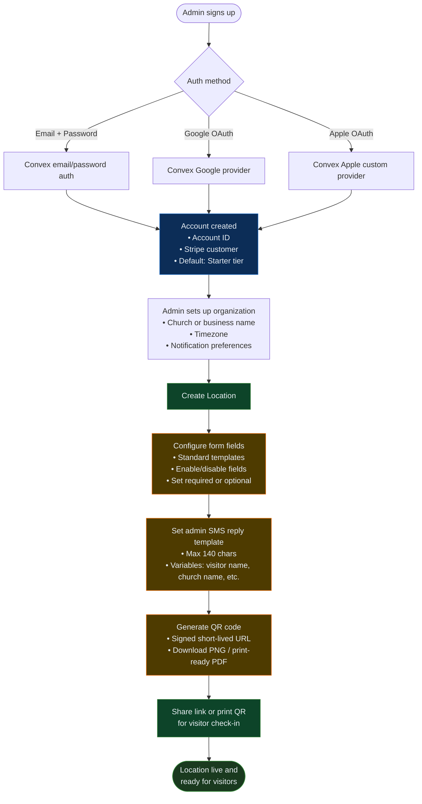
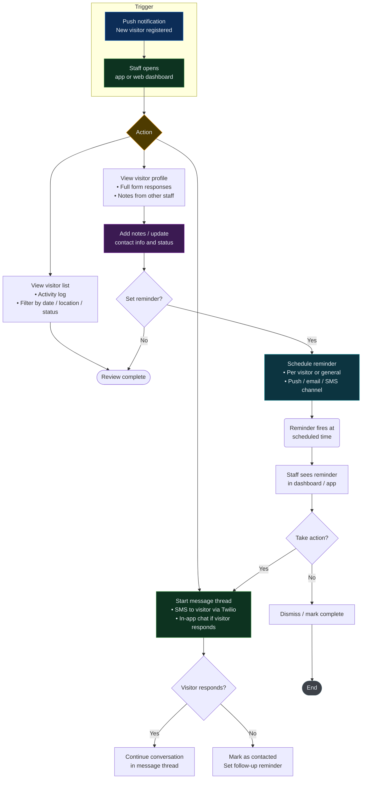
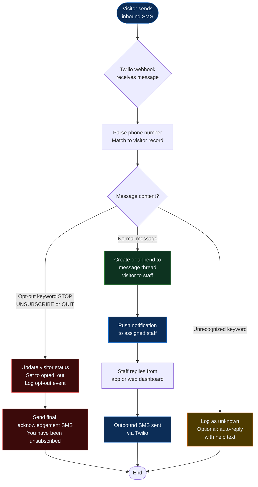

# E7 Guest System — Flow Chart

> Self-contained rendered version: `E7GuestSystem-FlowChart.html`
> Mermaid source below for version control. Render at [mermaid.live](https://mermaid.live).

---

## 1 · Visitor Check-In Flow (Web / Public)

```mermaid
flowchart TD
    A([Visitor arrives at location]) --> B{Has QR code<br>or shared link?}
    B -- Scans QR<br>or opens link --> C[Land on<br>visitor form page]
    C --> D[Fill out form<br>• Name(s)<br>• Party size<br>• Local / Moving<br>• Friends/Family in church<br>• Reason for visit<br>• Prayer request / Follow-up opt-in]
    D --> E{Opted in to<br>SMS follow-up?}

    E -- Yes --> F[System sends automated<br>SMS welcome message<br>via Twilio<br>using admin template]
    E -- No --> G[Record visitor only<br>No SMS sent]

    F --> H[Log visitor registration<br>in database<br>• Status: new<br>• Timestamp<br>• IP + consent record]
    G --> H

    H --> I[Push notification sent<br>to account admin / staff]
    I --> J[Visitor lands on<br>Thank You screen]
    J --> K([End])

    style C fill:#0d4429,stroke:#2e7d32,color:#e6edf3
    style F fill:#0c2d57,stroke:#1565c0,color:#e6edf3
    style G fill:#4e3b00,stroke:#f9a825,color:#e6edf3
    style H fill:#3b1a52,stroke:#7b1fa2,color:#e6edf3
    style I fill:#0c2d57,stroke:#1565c0,color:#e6edf3
    style J fill:#0d4429,stroke:#2e7d32,color:#e6edf3
```

---

## 2 · Account Admin Onboarding Flow



---

## 3 · Staff Follow-Up Flow (App / Web Dashboard)



---

## 4 · Inbound SMS Processing Flow



---

## 5 · System Architecture Overview

```mermaid
flowchart LR
    subgraph Frontend
        F1[Vite plus React PWA<br>Visitor forms and admin dashboard]
        F2[Expo App<br>Staff mobile CRM and messaging]
    end

    subgraph Backend
        B1[Convex<br>Auth, DB, Server functions]
        B2[Twilio<br>SMS send, receive, webhooks]
        B3[Resend<br>Transactional email]
        B4[Stripe<br>Subscription billing]
    end

    subgraph Infrastructure
        I1[Netlify<br>Frontend hosting and CI/CD]
        I2[GitHub Actions<br>Lint, test, deploy]
        I3[Sentry<br>Error tracking]
        I4[PostHog<br>Analytics]
    end

    F1 -- API calls --> B1
    F2 -- API calls --> B1
    B1 -- SMS send --> B2
    B2 -- Webhooks --> B1
    B1 -- Email send --> B3
    B1 -- Billing --> B4
    B1 -- Deploy --> I1
    B1 -- CI/CD --> I2
    B1 -- Error logs --> I3
    F1 and F2 -- Usage data --> I4

    style F1 fill:#0d3320,stroke:#27ae60,color:#e6edf3
    style F2 fill:#0d3320,stroke:#27ae60,color:#e6edf3
    style B1 fill:#0c2d57,stroke:#2980b9,color:#e6edf3
    style B2 fill:#4e3b00,stroke:#e67e22,color:#e6edf3
    style B3 fill:#4e3b00,stroke:#e67e22,color:#e6edf3
    style B4 fill:#4e3b00,stroke:#e67e22,color:#e6edf3
    style I1 fill:#1a1a40,stroke:#8e44ad,color:#e6edf3
    style I2 fill:#1a1a40,stroke:#8e44ad,color:#e6edf3
    style I3 fill:#1a1a40,stroke:#8e44ad,color:#e6edf3
    style I4 fill:#1a1a40,stroke:#8e44ad,color:#e6edf3
```

---

*Generated for E7 Guest System -- 2026*